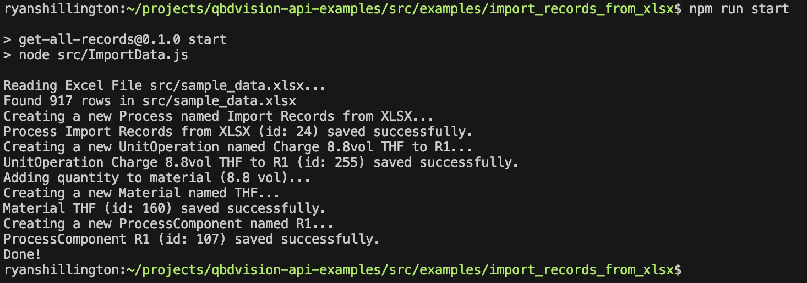

# Import Records from Excel (Node.js)

This example demonstrates how to load data from Excel using the QbDVision's REST API with Node.js.

## Prerequisites

- Node.js 20.x or higher
- A QbDVision API key

## Getting Started

1. Install the dependencies
```bash
npm install
```
2. Copy `.env.example` to `.env` and fill in:
    1. Modify `API_Key` to be your QbDVision API key.
    2. Modify `BASE_URL` to point to your QbDVision environment if you're not using Sandbox.
    3. Modify `PROJECT_ID` to be the project where you want to import the data.
3. Run the example:
```bash
npm run start
````

## Output
The output will look something like this:


# Best Practices for Production
- Use a key store for API keys
- Implement proper error handling and retries
- Add logging/reporting according to your company's standards
- Use the latest versions of all libraries
