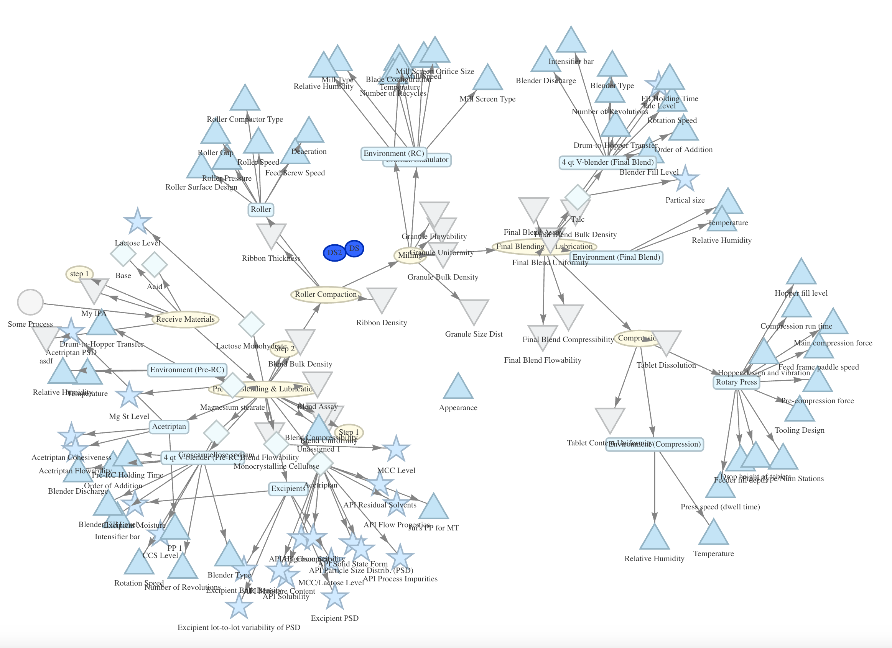

# Process Graph Example (Node.js)

This example demonstrates how to download all of the records in a process using
the QbDVision REST API with Node.js and then display them in a diagram.

## Prerequisites

- Node.js 20.x or higher
- A QbDVision API key

## Getting Started

1. Install the dependencies

```bash
npm install
```

2. Edit `src/download.js` and replace `YOUR_API_KEY` with your QbDVision API key.
3. Modify `BASE_URL` to point to your QbDVision environment if you're not using
   Sandbox.
4. Modify `PROJECT_ID` and `PROCESS_ID` to be the project and process ID that
   you want to see.
5. Build the example:
```bash
npm run build
```
5. Download the process data:
```bash
npm run download
```
5. Launch the web server:
```bash
npm run start
````
6. Navigate to `http://localhost:3000` in your browser.

## Output
The output on the webpage will look something like:


# Best Practices for Production

- Use environment variables for API keys
- Implement proper error handling and retries
- Add logging/reporting according to your company's standards
- Use the latest versions of all libraries

